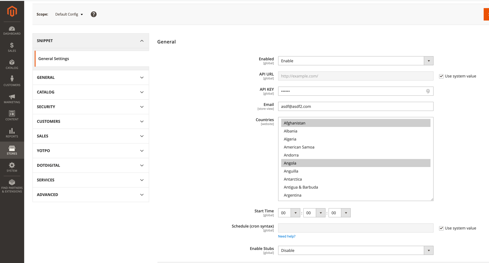
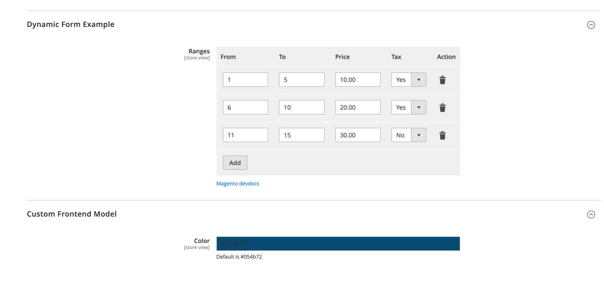
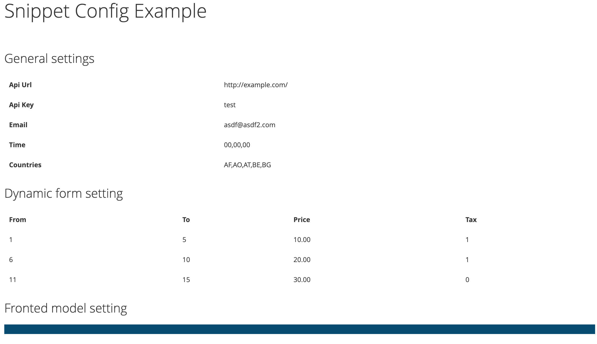

***Snippet_SystemConfig***

Task: Create a stores > configuration config

**How to install**
- composer require eugene-petrov/magento2-system-config
- php bin/magento module:enable Snippet_SystemConfig
- php bin/magento setup:upgrade
- php bin/magento clean:cache

**Example**

How it looks like in backend:

How it looks like in frontend http://{host.name}/snippet/config:

[Magento DevDocs reference:](https://devdocs.magento.com/)

- [system.xml reference](https://devdocs.magento.com/guides/v2.4/config-guide/prod/config-reference-systemxml.html)
- [Creating a dynamic row system config](https://devdocs.magento.com/guides/v2.4/ext-best-practices/tutorials/dynamic-row-system-config.html)
